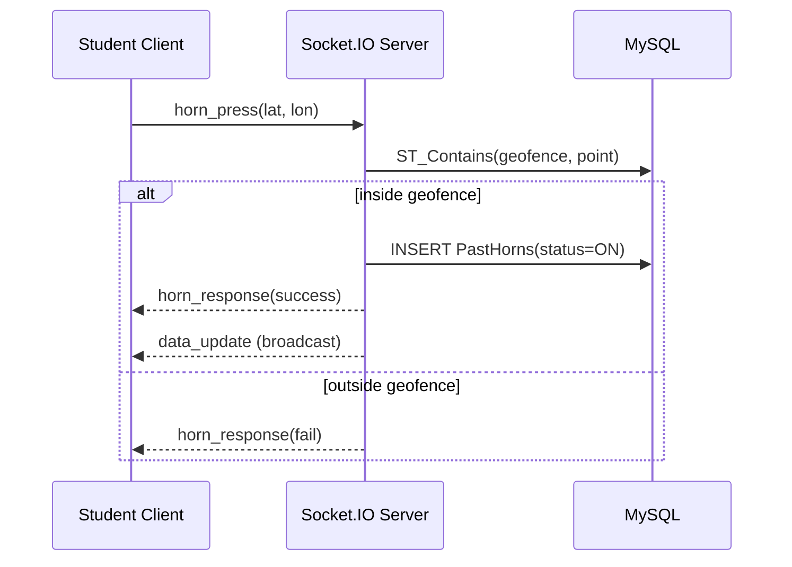
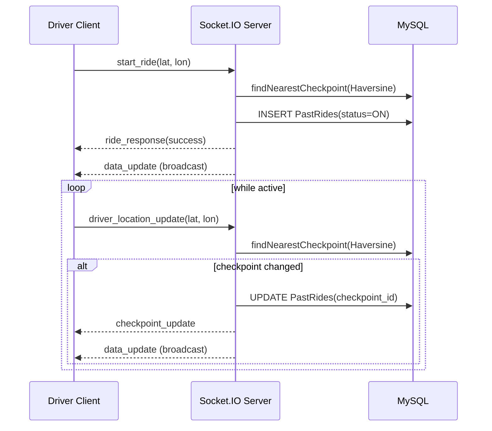

# AutoRide: Real-Time Campus Auto Coordination Using GPS Geofencing and WebSockets

## IEEE-formatted (LaTeX) version
If you want an actual IEEE-style formatted paper source, see `paper/main.tex` (bibliography: `paper/references.bib`).

Compile (from `paper/`):
- `pdflatex main.tex`
- `bibtex main`
- `pdflatex main.tex`
- `pdflatex main.tex`

> Replace the placeholders (authors, institution, results) before submission.

## Title (suggestions)
- **AutoRide: Real-Time Campus Auto-Ride Coordination Using GPS Geofencing and WebSockets**
- **Reducing Campus Pickup Waiting Time via Geofenced Demand Signaling and Real-Time Broadcast**

## Authors
- Author 1, Author 2, Author 3
- Department / College / University
- Emails

## Abstract
Daily campus commuting often suffers from a demand–supply visibility gap: students wait at pickup points without knowing whether any auto-rickshaw drivers are nearby, while drivers circulate without knowing where groups of students are waiting. This work presents **AutoRide**, a lightweight real-time coordination system that connects students and auto drivers using (i) **GPS-based geofencing** for validating student pickup locations and (ii) **WebSocket-based broadcasting** for instantly sharing active demand and supply information across all connected users. Students can trigger a time-bounded “horn” signal only when physically inside a designated geofenced pickup area; drivers can start a ride session at the nearest checkpoint and automatically update their checkpoint as they move. The system persists activity as event logs in a relational database, enabling dashboards for temporal and spatial analysis of demand (horns) and supply (rides). We describe the system architecture, security model, spatial algorithms, and analytics pipeline, and we outline an evaluation methodology using both live usage and seeded datasets.

**Keywords:** geofencing, WebSockets, real-time systems, intelligent transportation, campus mobility, demand–supply coordination

---

## 1. Introduction
### 1.1 Motivation
In many college towns, students depend on auto-rickshaws for short-distance commutes. A frequent failure mode is **lack of coordination**: students have no channel to signal demand to nearby drivers, and drivers have no visibility into where demand is accumulating.

### 1.2 Problem Statement
We target two operational constraints:
1. **Location validity:** demand signaling should only be allowed at authorized pickup zones (to reduce noise and improve driver trust).
2. **Low-latency visibility:** once demand/supply changes, all users should see updates immediately without repeatedly polling the server.

### 1.3 Contributions
This project contributes:
- A two-role platform (**student**, **driver**) with secure authentication and session handling.
- A **geofence-validated demand signal** (“horn”) for students.
- A **checkpoint-based supply signal** (“ride session”) for drivers using nearest-checkpoint detection.
- A real-time broadcast layer using WebSockets to keep all clients consistent.
- An event-log database design enabling analytics and dashboard visualizations.

---

## 2. System Overview
AutoRide consists of three main layers:
1. **Web client (React):** login/signup, horn/ride controls, real-time tables, profile management, dashboards.
2. **Backend (Node.js + Express):** REST APIs for authentication/profile/history/dashboard; Socket.IO server for real-time signaling.
3. **Database (MySQL):** stores users, locations/checkpoints, geofence geometry, and horn/ride event logs.

### 2.1 Roles and Core User Actions
**Student actions**
- Login / signup
- Press **Horn** to broadcast pickup demand (only inside a geofenced location)
- Horn auto-stops when leaving the pickup zone (based on periodic location updates)
- View **Past Horns** history

**Driver actions**
- Login
- Start **Ride** at nearest checkpoint
- Periodically update location; checkpoint updates if nearest checkpoint changes
- Ride auto-ends after a maximum session duration
- View **Past Rides** history

**All users**
- See real-time active students grouped by location and active drivers grouped by checkpoint
- View a dashboard summarizing activity patterns

---

## 3. Architecture and Data Flow
### 3.1 REST API Layer
AutoRide uses REST endpoints for account lifecycle and analytics:
- Student: signup/login
- Driver: login
- Token verification
- Profile update
- Fetch past activity logs
- Fetch dashboard aggregates

### 3.2 Real-Time Layer (WebSockets)
AutoRide uses Socket.IO for real-time synchronization:
- Authenticated socket handshake using a JWT token
- Broadcast events whenever horn/ride state changes
- Periodic client-to-server location updates while a session is active

### 3.3 Broadcast Consistency Model
Instead of maintaining complex shared state in memory, the server treats MySQL as the source of truth:
- On changes, it queries **active horns grouped by location** and **active rides grouped by checkpoint**
- It emits a `data_update` event to all connected clients

This design is simple and consistent, at the cost of query load under high concurrency.

---

## 4. Database Design
This section describes the conceptual schema inferred from the implementation.

### 4.1 Entities
**Users**
- `Students(student_id, name, year, branch, section, email, password_hash, created_at, …)`
- `Drivers(driver_id, name, auto_reg_no, email, password_hash, created_at, …)`

**Locations and Geofences**
- `Locations(location_id, location_name, location_description, …)`
- `Location_Geofence_Points(location_id, fence)` where `fence` is a geometry polygon (SRID 4326)
- Optional UI mapping table: `Location_UI_Coordinates(location_id, device_type, x_coordinate, y_coordinate)`

**Checkpoints**
- `Checkpoints(checkpoint_id, checkpoint_name, latitude, longitude, sequence_order, …)`
- Optional UI mapping table: `Checkpoint_UI_Coordinates(checkpoint_id, device_type, x_coordinate, y_coordinate)`

**Event Logs**
- `PastHorns(horn_id, student_id, location_id, status {ON/OFF}, created_at)`
- `PastRides(ride_id, driver_id, checkpoint_id, status {ON/OFF}, start_time)`

### 4.2 Relationships
- A student generates many horn events: `Students 1..* PastHorns`
- A driver generates many ride events: `Drivers 1..* PastRides`
- Each horn references a location: `Locations 1..* PastHorns`
- Each ride references a checkpoint: `Checkpoints 1..* PastRides`

### 4.3 Full MySQL Schema (DDL)
There is **no SQL migration/schema file in this repository**, so the following DDL is **reconstructed from the tables/columns and SQL queries used by the backend** (models, controllers, socket handlers, and seed scripts). It should match the minimum schema required to run the project.

If you want the **exact** schema from your live database for publication, extract it and paste it here:
- `mysqldump --no-data -u <user> -p <db_name> > schema.sql`
- or run `SHOW CREATE TABLE <table>;` for each table.

```sql
-- AutoRide Database Schema (MySQL 8+)
-- Notes:
-- 1) Geofencing uses ST_Contains on a polygon column with SRID 4326.
-- 2) Status fields are modeled as ENUM('ON','OFF') as used throughout the code.
-- 3) This DDL is a best-effort reconstruction from code-level usage.

SET NAMES utf8mb4;
SET time_zone = '+00:00';

-- =============================
-- USERS
-- =============================

CREATE TABLE IF NOT EXISTS Students (
  student_id BIGINT UNSIGNED NOT NULL AUTO_INCREMENT,
  name VARCHAR(128) NOT NULL,
  year VARCHAR(16) NOT NULL,
  branch VARCHAR(64) NOT NULL,
  section VARCHAR(8) NOT NULL,
  email VARCHAR(191) NOT NULL,
  password_hash VARCHAR(255) NOT NULL,
  created_at DATETIME NOT NULL DEFAULT CURRENT_TIMESTAMP,
  PRIMARY KEY (student_id),
  UNIQUE KEY uq_students_email (email)
) ENGINE=InnoDB DEFAULT CHARSET=utf8mb4;

CREATE TABLE IF NOT EXISTS Drivers (
  driver_id BIGINT UNSIGNED NOT NULL AUTO_INCREMENT,
  name VARCHAR(128) NOT NULL,
  auto_reg_no VARCHAR(64) NOT NULL,
  email VARCHAR(191) NOT NULL,
  password_hash VARCHAR(255) NOT NULL,
  created_at DATETIME NOT NULL DEFAULT CURRENT_TIMESTAMP,
  PRIMARY KEY (driver_id),
  UNIQUE KEY uq_drivers_email (email)
) ENGINE=InnoDB DEFAULT CHARSET=utf8mb4;

-- =============================
-- LOCATIONS + GEOFENCING
-- =============================

CREATE TABLE IF NOT EXISTS Locations (
  location_id BIGINT UNSIGNED NOT NULL AUTO_INCREMENT,
  location_name VARCHAR(128) NOT NULL,
  location_description TEXT NULL,
  PRIMARY KEY (location_id),
  UNIQUE KEY uq_locations_name (location_name)
) ENGINE=InnoDB DEFAULT CHARSET=utf8mb4;

-- The code joins Locations to this table and runs ST_Contains(lgp.fence, POINT(...)).
-- Using a single polygon per location (PK = location_id) is sufficient for the current queries.
CREATE TABLE IF NOT EXISTS Location_Geofence_Points (
  location_id BIGINT UNSIGNED NOT NULL,
  fence POLYGON SRID 4326 NOT NULL,
  PRIMARY KEY (location_id),
  SPATIAL INDEX spx_location_fence (fence),
  CONSTRAINT fk_lgp_location
    FOREIGN KEY (location_id) REFERENCES Locations(location_id)
    ON DELETE CASCADE ON UPDATE CASCADE
) ENGINE=InnoDB DEFAULT CHARSET=utf8mb4;

-- Optional: used by Location.getUICoordinates(deviceType)
CREATE TABLE IF NOT EXISTS Location_UI_Coordinates (
  location_id BIGINT UNSIGNED NOT NULL,
  device_type VARCHAR(32) NOT NULL,
  x_coordinate INT NOT NULL,
  y_coordinate INT NOT NULL,
  PRIMARY KEY (location_id, device_type),
  CONSTRAINT fk_luc_location
    FOREIGN KEY (location_id) REFERENCES Locations(location_id)
    ON DELETE CASCADE ON UPDATE CASCADE
) ENGINE=InnoDB DEFAULT CHARSET=utf8mb4;

-- =============================
-- CHECKPOINTS
-- =============================

CREATE TABLE IF NOT EXISTS Checkpoints (
  checkpoint_id BIGINT UNSIGNED NOT NULL AUTO_INCREMENT,
  checkpoint_name VARCHAR(128) NOT NULL,
  latitude DECIMAL(10,7) NOT NULL,
  longitude DECIMAL(10,7) NOT NULL,
  sequence_order INT NOT NULL,
  PRIMARY KEY (checkpoint_id),
  UNIQUE KEY uq_checkpoints_sequence (sequence_order),
  UNIQUE KEY uq_checkpoints_name (checkpoint_name),
  KEY idx_checkpoints_lat_lon (latitude, longitude)
) ENGINE=InnoDB DEFAULT CHARSET=utf8mb4;

-- Optional: used by Checkpoint.getUICoordinates(deviceType)
CREATE TABLE IF NOT EXISTS Checkpoint_UI_Coordinates (
  checkpoint_id BIGINT UNSIGNED NOT NULL,
  device_type VARCHAR(32) NOT NULL,
  x_coordinate INT NOT NULL,
  y_coordinate INT NOT NULL,
  PRIMARY KEY (checkpoint_id, device_type),
  CONSTRAINT fk_cuc_checkpoint
    FOREIGN KEY (checkpoint_id) REFERENCES Checkpoints(checkpoint_id)
    ON DELETE CASCADE ON UPDATE CASCADE
) ENGINE=InnoDB DEFAULT CHARSET=utf8mb4;

-- =============================
-- EVENT LOGS
-- =============================

CREATE TABLE IF NOT EXISTS PastHorns (
  horn_id BIGINT UNSIGNED NOT NULL AUTO_INCREMENT,
  student_id BIGINT UNSIGNED NOT NULL,
  location_id BIGINT UNSIGNED NOT NULL,
  status ENUM('ON','OFF') NOT NULL DEFAULT 'ON',
  created_at DATETIME NOT NULL DEFAULT CURRENT_TIMESTAMP,
  PRIMARY KEY (horn_id),
  KEY idx_past_horns_student_time (student_id, created_at),
  KEY idx_past_horns_location_status (location_id, status),
  KEY idx_past_horns_status (status),
  CONSTRAINT fk_past_horns_student
    FOREIGN KEY (student_id) REFERENCES Students(student_id)
    ON DELETE CASCADE ON UPDATE CASCADE,
  CONSTRAINT fk_past_horns_location
    FOREIGN KEY (location_id) REFERENCES Locations(location_id)
    ON DELETE RESTRICT ON UPDATE CASCADE
) ENGINE=InnoDB DEFAULT CHARSET=utf8mb4;

CREATE TABLE IF NOT EXISTS PastRides (
  ride_id BIGINT UNSIGNED NOT NULL AUTO_INCREMENT,
  driver_id BIGINT UNSIGNED NOT NULL,
  checkpoint_id BIGINT UNSIGNED NOT NULL,
  status ENUM('ON','OFF') NOT NULL DEFAULT 'ON',
  start_time DATETIME NOT NULL DEFAULT CURRENT_TIMESTAMP,
  PRIMARY KEY (ride_id),
  KEY idx_past_rides_driver_time (driver_id, start_time),
  KEY idx_past_rides_checkpoint_status (checkpoint_id, status),
  KEY idx_past_rides_status (status),
  CONSTRAINT fk_past_rides_driver
    FOREIGN KEY (driver_id) REFERENCES Drivers(driver_id)
    ON DELETE CASCADE ON UPDATE CASCADE,
  CONSTRAINT fk_past_rides_checkpoint
    FOREIGN KEY (checkpoint_id) REFERENCES Checkpoints(checkpoint_id)
    ON DELETE RESTRICT ON UPDATE CASCADE
) ENGINE=InnoDB DEFAULT CHARSET=utf8mb4;
```

---

## 5. Core Algorithms and Logic
### 5.1 Geofence Validation (Student Horn)
When a student presses horn, the backend validates the GPS coordinate against geofenced pickup zones using MySQL spatial predicates.

**Input:** latitude, longitude from client geolocation

**Spatial containment query:**
- Uses `ST_Contains(polygon, point)` where the point is constructed with SRID 4326.

**Outcome:**
- If inside any fence: create a horn record with `status = ON`.
- If outside all fences: reject the request.

**Auto-stop logic:**
- While active, the client sends `student_location_update` periodically.
- If the student leaves all fences, the server updates the latest horn status to `OFF` and notifies the client.

### 5.2 Nearest Checkpoint Detection (Driver Ride)
When a driver starts a ride (and during subsequent movement), the backend selects the nearest checkpoint using a Haversine-based distance computation inside SQL.

Let latitude/longitude be $(\phi, \lambda)$ in radians. A common Haversine distance is:

$$
\begin{aligned}
\Delta\phi &= \phi_2 - \phi_1 \\
\Delta\lambda &= \lambda_2 - \lambda_1 \\
 a &= \sin^2(\Delta\phi/2) + \cos(\phi_1)\cos(\phi_2)\sin^2(\Delta\lambda/2) \\
 d &= 2R\arcsin(\sqrt{a})
\end{aligned}
$$

The implementation uses an equivalent spherical law-of-cosines form with Earth radius $R = 6371$ km.

**Outcome:**
- A ride is created with `status = ON` at the initial nearest checkpoint.
- During `driver_location_update`, if the nearest checkpoint changes, the active ride’s `checkpoint_id` is updated.

### 5.3 Session Expiration and Safety Bounds
To avoid stale “active” sessions:
- Driver rides are automatically ended after a maximum duration (15 minutes) using:
  - An online check during `driver_location_update`, and
  - A server-side periodic cleanup job that marks expired rides as `OFF`.

---

## 6. Security and Access Control
### 6.1 Authentication
AutoRide uses **JWT (JSON Web Tokens)** for both REST and WebSocket authentication.
- Token payload includes `id` and `type` (student/driver)
- Token expiry is 7 days

### 6.2 Authorization
- REST endpoints that read/write user data require a Bearer token.
- WebSocket connections require a token during handshake.
- The server derives the user record and role from the token and attaches it to the request/socket context.

---

## 7. Analytics and Dashboard
The backend provides aggregate analytics for dashboards:
- **Daily trends:** horns per day, rides per day
- **Distributions:** horns by location, rides by checkpoint
- **Hourly pattern:** horns by hour-of-day
- **Overview cards:** total horns, total rides, active now (horns ON + rides ON), peak hour

These metrics help quantify demand and supply patterns and identify peak congestion windows.

---

## 8. Dataset and Seeding (For Evaluation)
A seeding script generates realistic-looking test data:
- Creates a fixed set of student and driver accounts (with hashed passwords)
- Generates horn events and ride events across the past 30 days
- Produces peak-time clusters (morning and evening rush windows)

This seeded dataset supports repeatable demos and dashboard evaluation even without live usage.

---

## 9. Evaluation Methodology (Fill In With Your Results)
Because the system targets real-time coordination, evaluation should focus on both **latency** and **operational impact**.

### 9.1 Suggested Metrics
- End-to-end update latency (student horn press → all clients display update)
- Socket reconnection reliability under network drops
- Geofence false rejection/acceptance rate (GPS noise sensitivity)
- Driver checkpoint update correctness (nearest checkpoint accuracy)
- Reduction in average student waiting time (field study)

### 9.2 Experimental Setup Template
- Number of students/drivers involved:
- Campus pickup locations (geofence shapes and sizes):
- Checkpoints and spacing:
- Devices and browsers tested:
- Network conditions (Wi-Fi/4G):

### 9.3 Results (placeholder)
- Report summary tables/plots here.
- Avoid subjective claims; quantify with measured values.

---

## 10. Discussion, Limitations, and Future Work
### 10.1 Limitations (current implementation)
- Coordination is broadcast-based; there is no automatic matching/assignment between students and drivers.
- Real-time correctness depends on client geolocation availability and periodic updates.
- Hard-coded service URLs (localhost) require configuration for production.

### 10.2 Future Work
- Add a matching layer (e.g., batching horns by location and recommending driver routes)
- Improve geofence robustness under GPS jitter (smoothing, hysteresis)
- Add push notifications for drivers when demand spikes
- Add observability (structured logs, latency metrics)

---

## Appendix A: Reproducibility (How to Run)
### A.1 Backend
**Requirements:** Node.js, MySQL (with spatial/GIS support), and a `.env` file.

Environment variables used by backend:
- `PORT` (default 5000)
- `DB_HOST`, `DB_USER`, `DB_PASSWORD`, `DB_NAME`
- `JWT_SECRET`

Commands:
1. `cd backend`
2. `npm install`
3. `node server.js`

### A.2 Frontend
Commands:
1. `cd frontend`
2. `npm install`
3. `npm run dev`

### A.3 Seeding
- Ensure `Locations` and `Checkpoints` exist first.
- Run `node backend/scripts/seedData.js`.

---

## Appendix B: Diagrams (Paste Into Your Paper Tool)
### B.1 Architecture diagram (Mermaid)
```mermaid
flowchart LR
  subgraph Client[Web Client (React)]
    A[AuthContext\nJWT in localStorage]
    B[SocketContext\nGeolocation + Socket.IO]
  end

  subgraph Server[Backend (Node.js/Express)]
    C[REST API\n/auth/*]
    D[Socket.IO\nRealtime events]
  end

  subgraph DB[MySQL]
    E[(Students/Drivers)]
    F[(Locations + Geofence)]
    G[(Checkpoints)]
    H[(PastHorns/PastRides)]
  end

  A -->|Bearer JWT| C
  B -->|Socket handshake JWT| D
  C --> DB
  D --> DB
  D -->|data_update| B
```

### B.2 Student horn sequence (Mermaid)


### B.3 Driver ride sequence (Mermaid)

